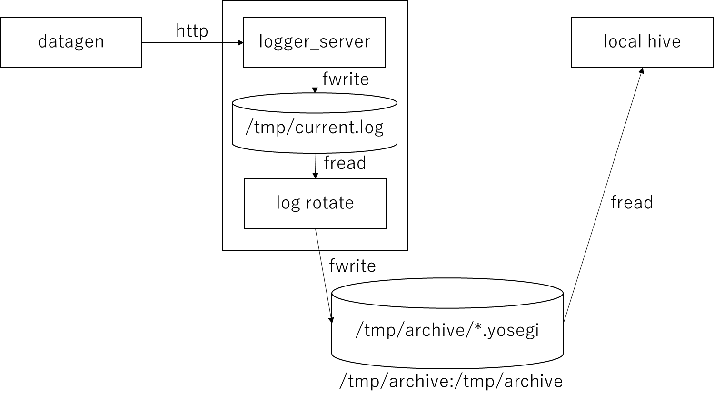

<!---
  Licensed under the Apache License, Version 2.0 (the "License");
  you may not use this file except in compliance with the License.
  You may obtain a copy of the License at

   http://www.apache.org/licenses/LICENSE-2.0

  Unless required by applicable law or agreed to in writing, software
  distributed under the License is distributed on an "AS IS" BASIS,
  WITHOUT WARRANTIES OR CONDITIONS OF ANY KIND, either express or implied.
  See the License for the specific language governing permissions and
  limitations under the License. See accompanying LICENSE file.
-->

# What is this?
This is a docker image to do a POC with Yosegi.



# Create docker images

Please execute the command in this directory.

```
sh build.sh
```

# Run docker images

Launch the image with docker-compose.

```
docker-compose up -d
```

# Run hive

Ser's results are sent to logger_server from datagen's docker image
logger_server converts to yosegi files every minute.
This destination volume can be written and read by logger_server and local_hive.

Login to local_hive.

```
$ docker exec -it local_hive /bin/bash

$ ls /tmp/archive/
archive.2019-04-24-07-11.yosegi
archive.2019-04-24-07-12.yosegi

$ hive -e "select * from default.example_yosegi limit 100"

1556091660346   547460  15883192        96.67   0       10662328        2348900 6309124 32
1556091662386   546896  15883756        96.67   0       10662332        2348900 6308832 48
1556091664427   547380  15883272        96.67   0       10662332        2348900 6309064 48
1556091666465   547800  15882852        96.67   0       10662332        2348900 6309296 36
1556091668504   547592  15883060        96.67   0       10662332        2348900 6308688 40
1556091670543   548536  15882116        96.66   0       10662336        2348900 6309148 44
1556091672583   548172  15882480        96.66   0       10662336        2348900 6309020 36
1556091674622   548900  15881752        96.66   0       10662336        2348900 6309256 36
```

# Send log

If you want to send the original log, please refer to the following example.


```
# parent
$ curl -X POST -d 'message={"log_name":"my_log","hoge":100}'  localhost:12345/logging

# datagen, logger_server, local_hive
$ curl -X POST -d 'message={"log_name":"my_log","hoge":100}'  logger_server:8080/loggig

```

Please wait up to one minute until it is rotated.
Create a table referring to [Hive quick start](https://github.com/yahoojapan/yosegi-hive/blob/master/docs/quickstart.md).

```

hive>
CREATE EXTERNAL TABLE custom_table (
  log_name string,
  hoge int
)
ROW FORMAT SERDE
  'jp.co.yahoo.yosegi.hive.YosegiSerde'
STORED AS INPUTFORMAT
  'jp.co.yahoo.yosegi.hive.io.YosegiHiveLineInputFormat'
OUTPUTFORMAT
  'jp.co.yahoo.yosegi.hive.io.YosegiHiveParserOutputFormat'
LOCATION '/tmp/archive';


hive> 
select * from custom_table where log_name is not null;
OK
my_log  100
my_log  100
my_log  100
my_log  100

```
